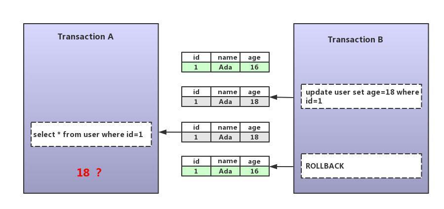
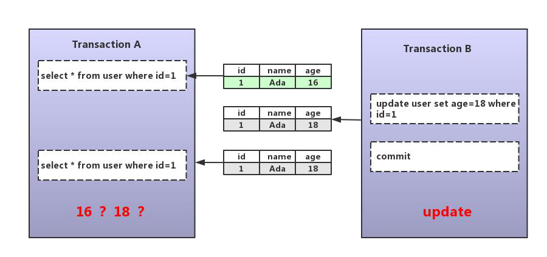
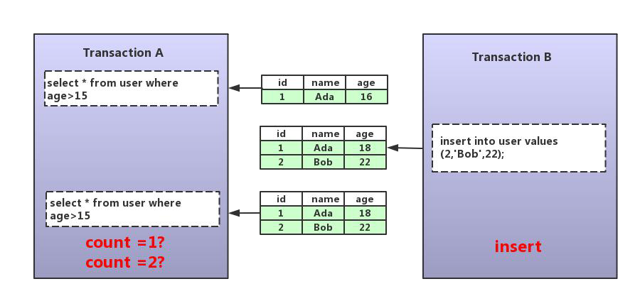

# MySQL事务

[数据库事务](https://baike.baidu.com/item/%E6%95%B0%E6%8D%AE%E5%BA%93%E4%BA%8B%E5%8A%A1/9744607)(Database Transaction) ，是指作为单个逻辑工作单元执行的一系列[操作](https://baike.baidu.com/item/%E6%93%8D%E4%BD%9C/33052)，要么完全地执行，要么完全地不执行。

​	事务的ACID特性，事务并发带来了哪些特性，事务的四种隔离级别。

# 什么是事务

[事务](https://baike.baidu.com/item/%E4%BA%8B%E5%8A%A1/5945882)（Transaction），一般是指要做的或所做的事情。在计算机[术语](https://baike.baidu.com/item/%E6%9C%AF%E8%AF%AD)中是指访问并可能更新数据库中各种[数据项](https://baike.baidu.com/item/%E6%95%B0%E6%8D%AE%E9%A1%B9/3227309)的一个程序执行单元(unit)。

[数据库事务](https://baike.baidu.com/item/%E6%95%B0%E6%8D%AE%E5%BA%93%E4%BA%8B%E5%8A%A1/9744607)(Database Transaction) ，是指作为单个逻辑工作单元执行的一系列[操作](https://baike.baidu.com/item/%E6%93%8D%E4%BD%9C/33052)，要么完全地执行，要么完全地不执行。


典型事务场景(转账)：

```mysql
update user_account set balance = balance - 1000 where userID = 3;
update user_account set balance = balance +1000 where userID = 1;
```

mysql中如何开启事务：

`begin` / `start` `transaction` -- 手工

`commit` / `rollback` -- 事务提交或回滚

`set session autocommit = on/off;` -- 设定事务是否自动开启

JDBC 编程：

`connection.setAutoCommit（boolean）;`

Spring 事务AOP编程：

`expression=execution（com.xxx.service.*.*(..)）`

# 事务的ACID特性

- **原子性（Atomicity）**

  ​	整个事务中的所有操作，要么全部完成，要么全部不完成，不可能停滞在中间某个环节。事务在执行过程中发生错误，会被[回滚](https://baike.baidu.com/item/%E5%9B%9E%E6%BB%9A)（Rollback）到事务开始前的状态，就像这个事务从来没有执行过一样。

- **一致性（Consistency）**

  ​	一个事务可以封装状态改变（除非它是一个只读的）。事务必须始终保持系统处于一致的状态，不管在任何给定的时间[**并发**](https://baike.baidu.com/item/%E5%B9%B6%E5%8F%91)事务有多少。

  ​	也就是说：如果事务是[**并发**](https://baike.baidu.com/item/%E5%B9%B6%E5%8F%91)多个，系统也必须如同串行事务一样操作。其主要特征是保护性和不变性(Preserving an Invariant)，以转账[案例](https://baike.baidu.com/item/%E6%A1%88%E4%BE%8B)为例，假设有五个账户，每个账户余额是100元，那么五个账户总额是500元，如果在这个5个账户之间同时发生多个转账，无论[**并发**](https://baike.baidu.com/item/%E5%B9%B6%E5%8F%91)多少个，比如在A与B账户之间转账5元，在C与D账户之间转账10元，在B与E之间转账15元，五个账户总额也应该还是500元，这就是保护性和不变性。

- **隔离性（Isolation）**

  一个事务所操作的数据在提交之前，对其他事务的可见性设定（一般设定为不可见）

- **持久性（Durability）**

  事务所做的修改就会永久保存，不会因为系统意外导致数据的丢失

# 事务并发带来了哪些问题

如下图，事务A和事务B 同时操作id为1的user

## 脏读(dirty read)

```mysql
1、事务B 修改id为1的用户age由16 --> 18
2、事务A 查询id为1的用户，获取到age为18
3、事务B 此时因为某些意外原因，rollback
（要理解1和3为同一个事务（最小执行单元））
此时数据库中的id为1的记录age还是16,而事务B并不之情，以为age是18，此时就出问题了，所谓的脏读
```



------

## 不可重复读(nonrepeatableread)

```mysql
1、事务A 查询id为1的用户，获取到age为16
2、事务B 修改id为1的用户，age由16 --> 18
3、事务B commit
4、事务A 查询id为1的用户，获取到age为18
（1和4一个事务 2和3一个事务，要理解成不可分割的最小执行单元）
此时事务A两次查询不一样，在一个事务重复读数据内容不一样，所谓的 不可重复读
```



------

## 幻读(Phantom read)

```
1、事务A 查询id为age > 15的用户，获取到一个用户，id为1，age为16的用户
2、事务B 新增id为2，name为‘Bob’，age为22的用户
3、事务A 再次查询age > 15的用户，获取到两个用户
（1和3一个事务 ，要理解成不可分割的最小执行单元）
此时事务A两次查询不一样，在一个事务重复读数据的数量一样，产生了幻觉，所谓的 幻读
```



`脏读`：很好理解，事务中，读取到脏数据。

`不可重复读`：事务中，多次读取同一个数据的内容不一样。(针对update)

`幻读`：事务中，多次读取同一个条件数据的数量不一样。（针对的是insert、delete）


如何解决上面三种问题呢？？？往下看

# 事务四种隔离级别

SQL92，是数据库的一个ANSI/ISO标准。它定义了一种语言（SQL）以及数据库的行为（事务、隔离级别等）。

SQL92 ANSI/ISO标准：
http://www.contrib.andrew.cmu.edu/~shadow/sql/sql1992.txt

## 四种隔离级别

- **Read Uncommitted（未提交读）** --未解决并发问题

  事务未提交对其他事务也是可见的，**脏读（dirty read）**

- **Read Committed（提交读）** --解决脏读问题

  一个事务开始之后，只能看到自己提交的事务所做的修改，**不可重复读（nonrepeatableread）**

- **Repeatable Read (可重复读)** --解决不可重复读问题

  在同一个事务中多次读取同样的数据结果是一样的，这种隔离级别未定义解决**幻读(Phantom read)**的问题

- **Serializable（串行化）** --解决所有问题

  最高的隔离级别，通过强制事务的串行执行

## Innodb引擎对隔离级别的支持程度

| 事务隔离级别                    | 脏读       | 不可重复读 | 幻读             | 并发能力 |
| ------------------------------- | ---------- | ---------- | ---------------- | -------- |
| Read Uncommitted（未提交读）    | 可能       | 可能       | 可能             | ☆☆☆☆     |
| Read Committed（提交读）        | 不可能     | 可能       | 可能             | ☆☆☆      |
| **Repeatable Read（可重复读）** | **不可能** | **不可能** | `对Innodb不可能` | ☆☆       |
| Serializable（串行化）          | 不可能     | 不可能     | 不可能           | ☆        |

并发能力 

Read Uncommitted > Read Committed > Repeatable Read > Serializable